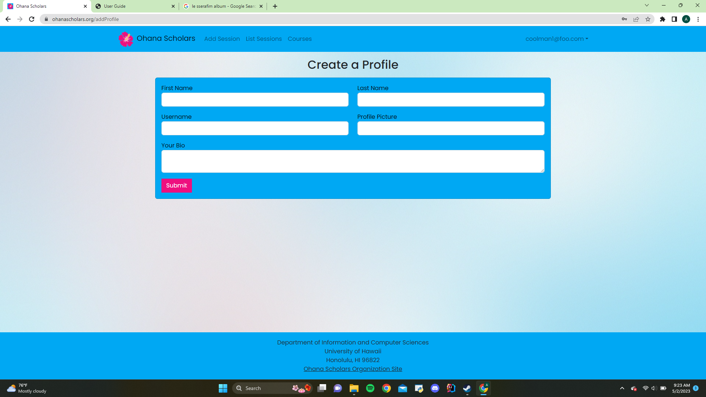

### Landing Page

When you first visit [https://ohanascholars.org/](https://ohanascholars.org/), you'll be greeted to the landing page. From there, you can create a new account to access sessions, courses, and profiles!

### Sign Up

When you click on sign up, you'll be redirected to the signup page. Enter your email and password to create an account

#### Add Profile

Once you create an account, you'll be asked to create a Profile. Input your first and last name, username, profile picture, and create a small bio about yourself.

#### Home Page

Once you create your profile, you will be redirected to your personal home page. You'll notice that you now have access to add and view sessions. You can also view your profile as well as all the courses listed in Ohana Scholars.

#### Profile Page

On the top right of the page (where your email is located), there is a dropdown menu to sign out and view your profile page. When you click view profile, you'll see the beautiful profile you created earlier.

#### Edit Profile

Following the profile page, below it will be a link that allows you to edit your profile. You'll be redirected to this page where you can change the info listed on your profile.

#### List Sessions

When you click list sessions on the navbar, you'll be redirected to the page that lists all the created sessions.

#### Add Sessions

From the list sessions page, when you click create new session, you'll be redirected to a form page that will allow you to add a new session to the list sessions page. If you click on the filter button on the top right corner, you can filter the sessions by their subjects. 

#### List Courses

Clicking on courses in the navbar will take you to a page that lists all the courses in Ohana Scholars. For ease of use, we have provided a filter that filters based on subject.

#### Rate Student

After attending a session, you may want to rate your fellow students on how helpful they were. This page allows you to rate a student from 1-10 and give a reason for your rating. 

#### Sign Out

Once you sign out, you will be redirected to this page where you can log in or return to the landing page.

# Use Case Ideas
<ul>
    <li>New user goes to landing page, creates new profile, gets home page, may edit their profile</li>
    <li>Admin goes to landing page, logs in, gets home page, edits sites or subjects.</li>
    <li>User goes to landing page, logs in, checks existing study sessions, requests new session if not applicable</li>
    <li>User is notified of new sessions, joins or ignores.</li>
    <li>User checks their reputation based on ratings</li>
    <li>User checks their emails and can reply or write new ones</li>
</ul>

# Beyond the Basics

After implementing the basic functionality, here are ideas for more advanced features:

<ul>
    <li>Email system for private messaging between students.</li>
    <li>A rating system for students participation.</li>
</ul>