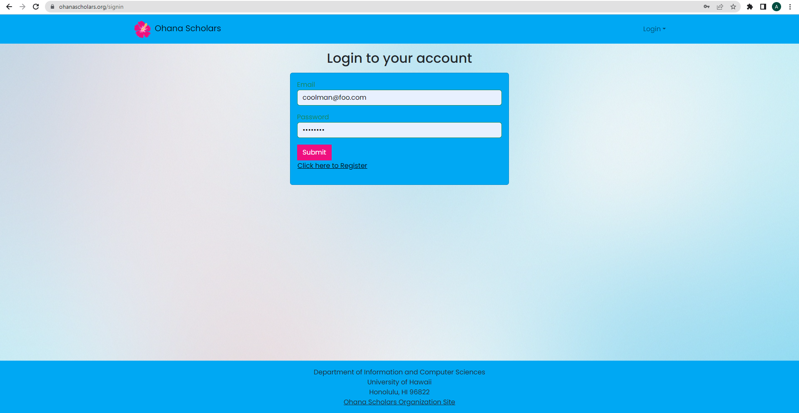
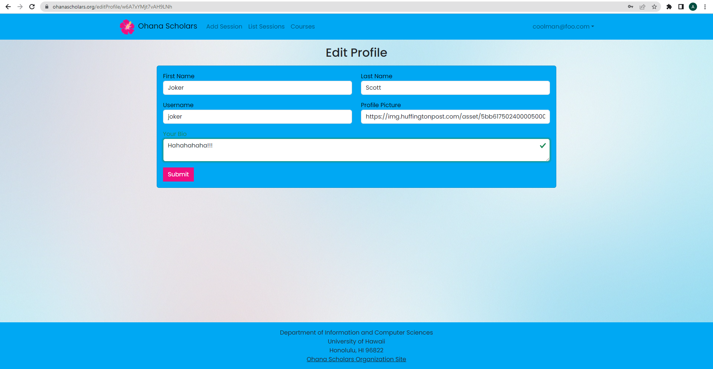
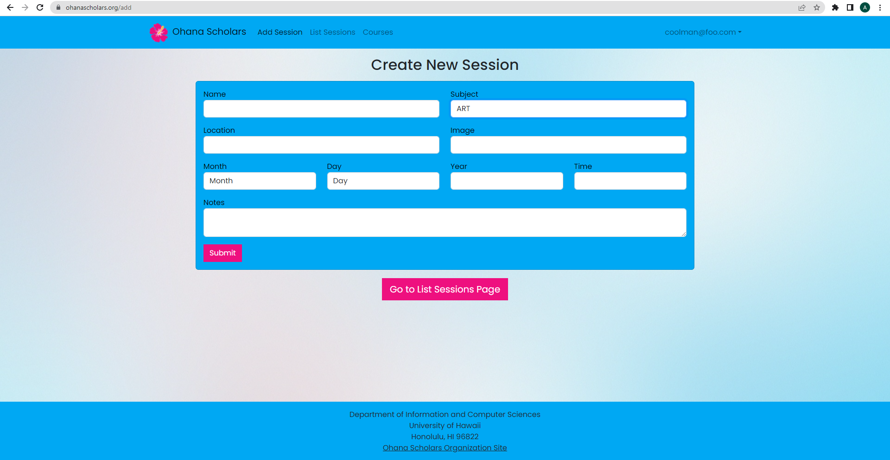
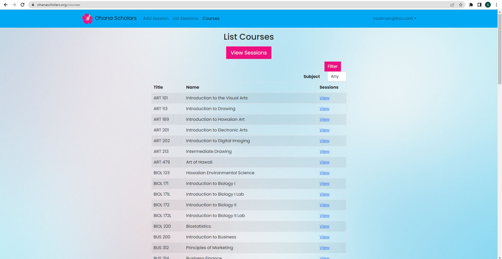

## Walkthrough

The following will walkthrough through how to use the Ohana Scholars website.

### Landing Page

When you first visit https://ohanascholars.org/, you'll be greeted to the landing page. From there, you can create a new account to access sessions, courses, and profiles!

### Sign Up

When you click on sign up, you'll be redirected to the signup page. Enter your email and password to create an account

#### Add Profile

Once you create an account, you'll be asked to create a Profile. Input your first and last name, username, profile picture, and create a small bio about yourself.

#### Home Page

Once you create your profile, you will be redirected to your personal home page. You'll notice that you now have access to add and view sessions. You can also view all the coureses listed in Ohana Scholars.

#### Profile Page

On the top right of the page (where your email is located), there is a dropdown menu to sign out and view your profile page. When you click view profile, you'll see the beautiful profile you created earlier.

#### Edit Profile

Following the profile page, below it will be a link that allows you to edit your profile. You'll be redirected to this page where you can change everything besides your username.

#### List Sessions

When you click list sessions on the navbar, you'll be redirected to the page that lists all the created sessions.

#### Add Sessions

From the list sessions page, when you click create new session, you'll be redirected to a form page that will allow you to add a new session to the list sessions page.

#### List Courses

Clicking on courses in the navbar will take you to a page that lists all the courses in Ohana Scholars. For ease of use, we have provided a filter that filters based on subject.

For additional assistance or questions contact us [here](https://www.youtube.com/watch?v=dQw4w9WgXcQ).
                      
jk, Contact us with this email: tungxn@hawaii.edu :)